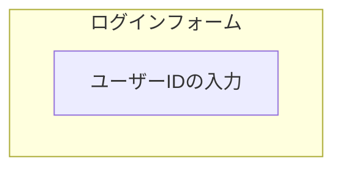

# コンピューターシステムにおける脆弱性の種類

1. ソフトウェア上の欠陥（プログラムレベルでの不備）
2. 利用するユーザーの判断ミス
3. マシンの性能不足
4. 物理的な無防備さ


## ソフトウェア上の欠陥
プログラムのミスによる脆弱性、プログラマーが意識するべきポイント

### SQLインジェクション
ユーザー入力のサニタイズが不十分なことによって、悪意のある入力によって開発者が想定していないSQLクエリが実行されてしまう

**具体例**
webアプリケーションにおけるログイン画面などにおいて、パスワードやユーザーIDを入力させる

開発者はIDに`1234`のようなIDが入力されることを想定して、入力されたIDに対して以下のSQLを実行するように実装
```sql
SELECT * FROM table WHERE id='user_id'
```
しかし、悪意のあるユーザーがID欄に対して以下の入力を行うと
```bash
ID: 1234' OR '1' = '1
```
サーバーで以下のSQLクエリが実行される
```sql
SELECT * FROM table WHERE id='1234' OR '1' = '1'
```
これは常に成り立ってしまうため、不正ログインが可能になる

### RCE(Remote Code Execution)
悪意のあるユーザー入力によって、悪意のあるコードがサーバーで実行されてしまう、テンプレートエンジンなどの利用で起こりやすい

**`jinja2`などの`Flask`などのサーバーサイドフレームワークで使われるテンプレートエンジンでの例**
webアプリケーションにおいてURLクエリなどに基づいて画面表示をカスタマイズするために
`https://example.com/?name=xxx`にアクセスした時に以下のpythonコードを実行する

```python
from flask import Flask, request, render_template_string
app = Flask(__name__)

@app.route("/")
def index():
    name = request.args.get("name", "")
    return render_template_string("Hello {{ name }}!")
```

悪意のあるユーザーがこれを利用するときに以下のurlをリクエスト
`https://example.com/?name={{7*7}}`
これに対してのサーバーの応答が以下の場合
```nginx
Hello 49!
```
サーバーが`jinja2`を使っていて、pythonコードを実行できることを確認できる

さらに、以下のクエリで、このサーバープロセスがどのような権限で実行されているのかも確認できる
```python
{{ self._TemplateReference__context.cycler.__init__.__globals__.os.popen('id').read() }}
```

もしこれでサーバープロセスが`root`（管理者権限）で動いていたら、さらにサーバーに対して悪意のあるコマンドを実行することができる

このRCEによる脆弱性が発生した事例は多い
- [Ruby on rails](https://jp.broadcom.com/support/security-center/attacksignatures/detail?asid=32518)
- [Java log4shell](https://www.ntt.com/business/services/xmanaged/lp/column/apache-log4j.html)

特に`Java`での`Apache Log4j`に見つかった、ロガーによって意図しないコードが実行されてしまうという脆弱性は全世界に大きな影響を与えた